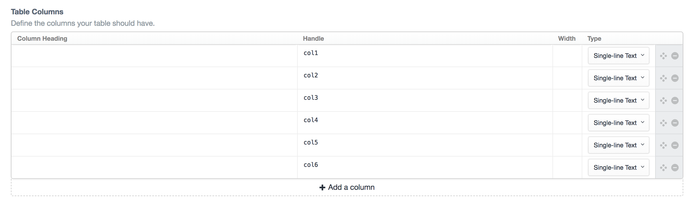
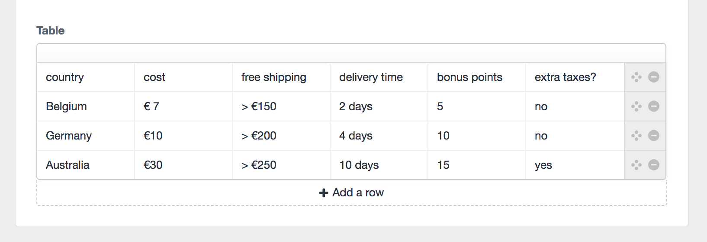
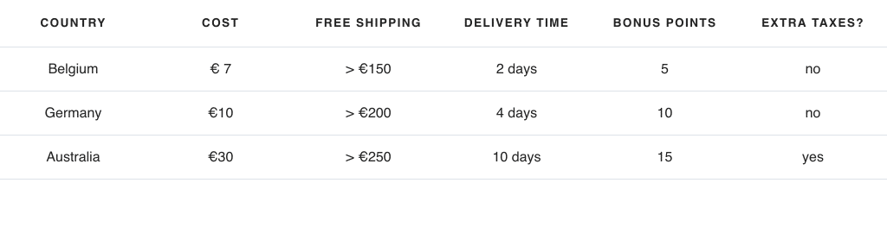

I saw a tweet from [Matt Smith](https://twitter.com/AllThingsSmitty/) passing by on responsive tables. Checking out the [pen](https://codepen.io/AllThingsSmitty/pen/MyqmdM) I thought it was an excellent way to implement responsive tables, so I decided to make a small reusable component for my Craft sites.  Have a look at the pen to understand what’s going on. Most important thing to notice: data-attributes are being used to provide content on the mobile version of the table.

## Creating the table
Time to make our own. Make a table field in Craft with 6 columns. Leave the column heading blank and set the handle for each column to `col` + the index.



Fill the table field with some dummy data and use the first line as the table header.



## Building the template

Make a new twig file in your templates folder. This is the actual component you're going to import later on. In the first step we’re going to set our table size. For now it's hardcoded. Next we'll create an empty object. We'll fill this object with the content of our table header (the first row) so we can pass it on to the other rows. Since we don't use the first row, we only need `tableSize - 1` as the amount of iterations. The empty object is now filled with key-value pairs, for example `label1:1`.

```twig
{# Set the table size here #}


{# Create empty object #}



 
 

```

Next step is to create the actual table. As we said before, we'll use the first row to create the table head.

```twig
<table class="responsive-table">

  
  <thead>
    <tr>
      <th scope="col">{{row.col1}}</th>
      
        
        
        
        
        <th scope="col">{{colValue}}</th>
      
    </tr>
  </thead>
  <tbody>
  
```

Notice that we also set the `labelName` in our empty object with the corresponding `colValue`. We need this value to set the data-attributes in our table:

```twig
  <tr>
   
    
     
     
      <td data-label="{{attribute(emptyObject, labelIndex)}}">{{attribute(row, colName)}}</td>
    
   
  </tr>
  
 
 </tbody>
</table>
```

We create the body of the table looping over the table size. For each `td` we set the `data-label` with the corresponding `colValue` and we use the `colName` for the actual content.

## Let's get dynamic

This is all fine, but it's not very handy. If the content creator wants to use a different table size, you'll have to rewrite the whole thing again and again, not very DRY.

In order to make it dynamic, we'll start by introducing a new variable `width`, which we will use to save the actual size of the table.

```twig{1,9,10,14}


<thead>
  <tr>
   <th scope="col">{{row.col1}}</th>
   
     
     
     
       
       
       
       <th scope="col">{{colValue}}</th>
    
   
  </tr>
</thead>
```

In the table head we check if there's a value in the first row (meaning the table head is not empty). If it's not empty we'll increase the width by 1. Next we'll use the `width ` to output only a `td` with the `data-label` if it's within our set size.

```twig{4}

  <tr>
  
    
      
      
      <td data-label="{{attribute(emptyObject, labelIndex)}}">{{attribute(row, colName)}}</td>
    
  
  </tr>

```

If there's an empty column, we won't render that column. Our table size is now dynamic based on the content that is entered in Craft.

## Styling

All we need now is a little styling. Add the following snippet of `.scss` to your code.

```scss
/* Responsive table */
table.responsive-table {
  border:1px solid #333;
  border-collapse:collapse;
  margin:0;
  padding:0;
  width:100%;
  caption{
   font-size:1.5em;
   margin:.5em 0 .75em;
  }
  tr {
    background:transparent;
    border:1px solid #333;
    padding:.35em;
  }
  th,
  td {
    text-align:center;
  }
  td{
    padding:12px 5px;
  }
  th{
    padding:16px;
    font-size:.85em;
    letter-spacing:.1em;
    text-transform:uppercase;
  }
  @media screen and (max-width:480px) {
    border:0;
    caption {
      font-size:1.3em;
    }
    thead{
      border:none;
      height:1px;
      margin:-1px;
      overflow:hidden;
      padding:0;
      position:absolute;
      width:1px;
    }
    tr{
      border-bottom:3px solid #333;
      display:block;
      margin-bottom:.625em;
    }
    td{
      border-bottom:1px solid #333;
      display:block;
      font-size:.8em;
      text-align:right;
    }
    td:before{
      /*
      * aria-label has no advantage, it won't be read inside a table
      content: attr(aria-label);
      */
      content:attr(data-label);
      float: left;
      font-weight:bold;
      text-transform: uppercase;
    }
    td:last-child {
      border-bottom:0;
    }
  }
}
```


## Wrapping it all up

You can now change the size of your table field to a max-size you want for your tables and give the content creator the simple instructions to only use the amount of columns he or she needs. The size will be dynamically calculated and the empty columns will not be shown, and your table will look good on mobile devices! You can off course customize the styling to your own needs.

The final component will look something like this. Just make sure you adjust the `tableSize` to your own max-size set in the admin panel.
```twig
{# Set the table size here #}


{# Create empty object #}



 
 




<table class="responsive-table">

  
  <thead>
    <tr>
     <th scope="col">{{row.col1}}</th>
     
       
       
       
         
         
         
         <th scope="col">{{colValue}}</th>
      
     
    </tr>
  </thead>
 <tbody>
  
    <tr>
    
      
        
        
        <td data-label="{{attribute(emptyObject, labelIndex)}}">{{attribute(row, colName)}}</td>
      
    
    </tr>
  

</tbody>
</table>
```
And the result:


