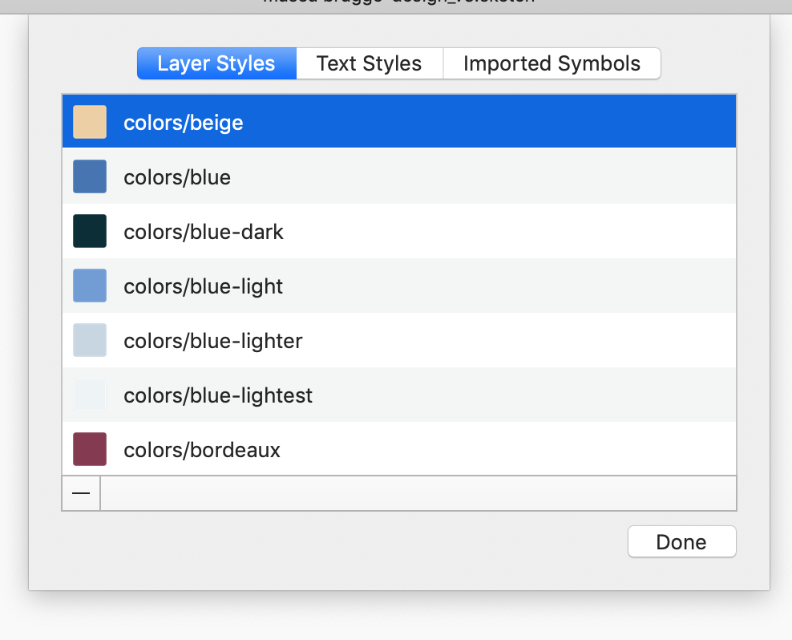

For those who don't know [Tailwind CSS](https://tailwindcss.com), it is a utility-first CSS framework for rapidly building custom user interfaces. It's developed and maintained by [Adam Wathan](https://twitter.com/adamwathan) and it has known a huge increase in popularity. Adam goes in depth in to the philopshy behind the framework in a very interesting blogpost: [CSS Utility Classes and "Separation of Concerns"](https://adamwathan.me/css-utility-classes-and-separation-of-concerns/). If you haven't read that post, make sure to give it a read.

[Sketch](https://www.sketchapp.com/) on the other hand is a design tool, available on Mac, that has become quiet popular for designing website or web applications. It's vector based, very intuitive to use and it's fast. 

## Mind the gap
Working with both of these tools, I was looking for a way to bridge the gap between them. What does that mean? I didn't want to manually copy data from Sketch files to my `tailwind.js` configuration file. Working on big projects, there are always colors you forget to take copy or font sizes you overlook. By automating the export to Tailwind CSS my design and my css stays in sync and chances of overlooking certain for example colors are greatly reduced.

## Designing for code
Tailwind at it's core works with a `tailwind.js` configuration file. In this file you define the properties of your design you will be using in your project:

- colors
- font-families
- font-sizes
- line-height
- paddings
- margins
- ....

The colors, for example, look something like this:
```javascript
let colors = {
  'transparent': 'transparent',
  'black': '#22292f',
  'grey-darkest': '#3d4852',
  'grey-darker': '#606f7b',
  'grey-dark': '#8795a1',
  'grey': '#b8c2cc',
```

As a developer it's very handy to know most of these properties at the start of a new project. Once the most important properties of your design are defined, you can dive straight into the code without having to think too much about them. It increases productivity a lot.

### Creating your theme
As a designer working in Sketch, you'll work with Layer Styles and Text Styles. Those are the base styles you define and reuse all in your design. Basically, what we would need in our `tailwind.js`. 🤔



The plugin let's you export properties from your design so you can use them in your Tailwind configuration. At this point the plugin picks up:
- colors
- font-families
- text-sizes. 


## Coding with design
The exported file will look something like this:
```javascript
const theme = {
  colors: {
    'blue-dark': '#092e38',
    bordeaux: '#853a51',
    beige: '#eed0a3',
    blue: '#4574b3',
    ...
  },
  fontSizes: {
    sm: '0.9375rem',
    base: '1rem',
    lg: '1.25rem',
    xl: '1.3125rem',
    ...
  },
  fonts: {
    helvetica: 'Helvetica',
    roboto: 'Roboto',
    adelle: 'Adelle'
  }
};
export default theme;
```

Notice the export at the bottom. This let's us import the theme file in to the `tailwind.js`  configuration file, like so:

```javascript
import theme from './theme';
```

Using the spread operator at the end of each property you can add the colors, fonts and font-sizes to your configuration file.
```javascript{8}
let colors = {
  'transparent': 'transparent',
  'black': '#22292f',
  'grey-darkest': '#3d4852',
  'grey-darker': '#606f7b',
  'grey-dark': '#8795a1',
  'grey': '#b8c2cc',
  ...theme.colors,
```
By adding the colors at the end, the theme will overwrite values that were are already present before the spread operator. This way you make sure you're using the colors you defined, not the defaults already present.

## Try it!

Ready to take it for a spin? You can download it from [Github](https://github.com/jan-dh/sketch-tailwind). The plan is to implement more properties to extract from Sketch and keep it compatible with the upcoming Tailwind 1.0 changes. Have some thoughts or ideas on it? Let me know!