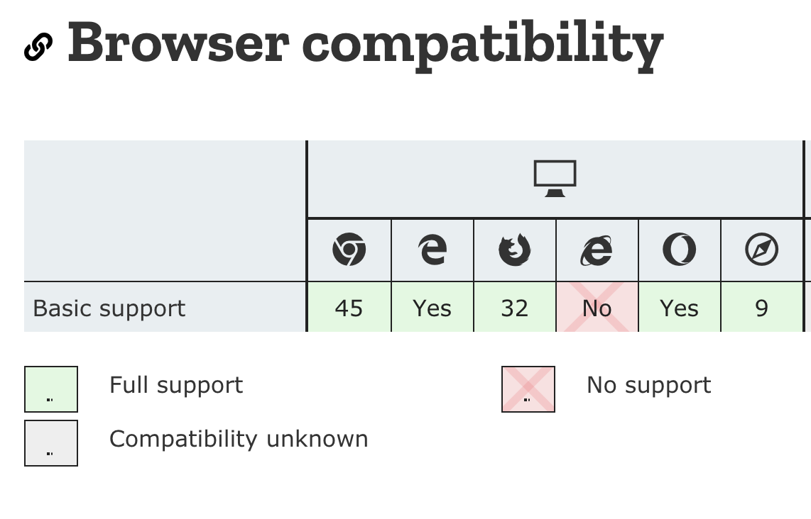

*__Important__: Babel 7.4 that released on 19/3/2019 introduced some breaking changes. I will update this article to reflect those changes, but until then: if you want to follow along with the article, use babel 7.3. The core concepts of the article still apply, only some minor changes I have to adjust*

In this post we'll set up a project with Webpack and Babel 7. You'll learn the basics of Babel and some cool features of what it can do with your code.

## What is Babel?
This is what the [website](https://babeljs.io/docs/en) says:
> Babel is a toolchain that is mainly used to convert ECMAScript 2015+ code into a backwards compatible version of JavaScript in current and older browsers or environments.

Babel is a JavaScript transpiler, something that compiles other code down to a standardized version of JavaScript. It can also be used to transpile Typescript or other languages to javascript. That way you can write next-generation javascript and old browsers or [node](https://nodejs.org/en/) can use your javascript.

## Why would I need it?
If you have a look at the [ECMAScript 6 compatibility table](https://kangax.github.io/compat-table/es6/) you can see that writing code that works on all devices (or all devices you want to target) can be complicated. You would have to manually check for specific browser support if want to use some of javascript newest features. Babel does a lot of this heavy lifting for you. Let's see how it works.

### Setting up a test-project
To show the magic of Babel, we'll set up a small project where we can play around with some javascript. Create a new folder `babel-test` and inside the folder make a `index.html` with the following markup:

```html
<!doctype html>
<html>
 <head>
  <title>Babel Test</title>
 </head>
 <body>
  <h1>This is a demo for Babel and Webpack</h1>
 </body>
 <script src="/dist/main.js"></script>
</html>
```

Run `npm init` from the command-line in the root of your project, this will create a `package.json`, and the following script to the scripts list:
```json
"dev":"webpack --watch",
```

Next we'll need to install Webpack. The following command will download Webpack and Webpack-cli and add it to your project's `devDependencies`:
```javascript
npm install webpack webpack-cli --save-dev
```

Webpack 4 doesn't require you to have your own Webpack configuration, but since we'll go beyond the baseline setup we're going to need one. Create a `webpack.config.js` in the root and add the following code:

```javascript
const path = require('path');

module.exports = {
  entry: './src/index.js',
  mode:'development',
  output: {
    filename: 'main.js',
    path: path.resolve(__dirname, 'dist')
  }
};
```

What we are saying here in our config file: look for an entry point `./src/index.js` and output it in the `dist` folder. So go ahead and make a `src`-folder and a `dist`-folder. Inside the `src`-folder create a javascript file called `main.js`. In our HTML we included the link to the built file (`/dist/main.js`).

The project setup should now look like this:
```bash
├── index.html
├── package.json
├── webpack.config.js
├── src
   ├── index.js
├── dist
```

To test if our Webpack is working, we will add a `console.log` to our `main.js`:
```javascript
console.log('Hello world');
```
When you run `npm run dev` (the script you added to your `package.json`), Webpack creates the built files within the `dist`-folder. If you point your local server environment (Mamp, Laravel Valet, ...) to the root of this project and open the website, you should see the console.log in your developer tools.

Notice that the `npm run dev` command has the `--watch` flag in our `package.json`, so it will refresh on save. This way we can play around with our javascript, without having to manually refresh the page each time. However, if you make changes to the `webpack.config.js`, you will need to re-run `npm run dev` to pick up changes in the config.

### Using new features of javascript
Everything works fine so far, but what happens if we try to use some next-generation javascript in our code? Change the code inside `main.js` to this:

```javascript
var array = [1,2,3];

Array.from(array).forEach(($item) => {
 console.log($item);
})
```
We make an array, and loop over each item with the `Array.from` method and log each item. When you check the console on a modern browser, you will see the output (`1 2 3`), but what happens when you open the console in IE11?

```javascript
Object doesn't support property or method 'from'
```

Why is this? As you can see [here](https://developer.mozilla.org/en-US/docs/Web/JavaScript/Reference/Global_Objects/Array/from#Browser_compatibility), IE11 doesn't have support for the `Array.from()` method.



How would you make sure that IE11 users can use your next-gen javascript code? That's right, that's where Babel comes in.

## How to use Babel
We will need a couple of different things to set up Babel:  a couple of `npm-packages`, a `.babelrc`-file and a `.browserslistrc`-file, both in the root of your project, and some tweaks to our `webpack.config.js`.

*Note that you do not really need a `.babelrc`-file. Your Babel configuration can be set in a number of different places, one of them is the `.babelrc`-file. You can read the options on what to choose for what occasion [here](https://babeljs.io/docs/en/next/configuration). The same goes for the `.browserslistrc`-file. A list of examples for browserlist integrations with other tools can be found over [here](https://github.com/browserslist/browserslist-example). That being said, for sake of clarity, in our test project we will set the options for both tools in those files.*

### Installing the dependencies
The functionality of Babel is split up in different npm-packages, so you can pick the parts you need for your project. The configuration for Babel is defined in a `.babelrc`-file.

Go ahead and install the packages we are going to need for this project. Make sure that you install `@babel/polyfill` as a dependency, not a dev-dependency:
```javascript
npm install --save-dev @babel/core @babel/register @babel/preset-env babel-loader
npm install --save  @babel/polyfill
```
These are the packages we will be using:
#### @babel/core
This package, as the name would suggest, is the core package. The package is responsible for compiling javascript code and outputting usable code. By default it uses your local configuration, but we will get into that later on.
#### @babel/register
This package will enable us to use new features of javascript in our Webpack config. So not only the code we are going to output runs through Babel, but our javascript config files for Webpack will run through it as well.
#### @babel/preset-env
Knowing what browser supports what javascript feature is essential in transforming your code. Here is where `preset-env` comes in. It handles what transforms should be applied, based on your own input. You tell Babel: "I need support for these browsers", and it will transform your javascript so it will work on the list you provide.
#### @babel/polyfill
Sometimes the browsers you want to support need a little extra help for certain features. `@babel/polyfill` will provide polyfills for those featured, based on what browsers you wish to support.
#### babel-loader
Since we will be using Webpack, this package allows us to transpile our code using Babel and Webpack.

*Do note that the packages all share the same namespace. Babel 7 moved to a monorepo structure, meaning that all packages share the same [repository](https://github.com/babel/babel). The packages used to have their own repository, so if you are installing them, make sure you install the right version.*


### .babelrc
Next up, create a `.babelrc`-file in the root of your project. Babel will look for this file as a source for your configuration. There are a lot of options you can set there, but for now, we will go with these:
```bash
{
	"presets": [
		["@babel/preset-env", {
			"debug":true
		}]
	]
}
```

This will tell Babel to use the `preset-env`-package to look for what browsers to support.

### .browserslistrc
The easiest way to tell Babel what browsers to use it to make a `.browserslistrc` file. Create a `.browserslistrc`-file. This file contains a list of the browsers you wish to support. [Browserlist](https://github.com/browserslist/browserslist) has a really nice [tool](http://browserl.ist/) that you can play around with to show you what browsers are selected based on the query you write. For example, this is the one I'm using:
```bash
# Browsers that we support
> .05% in BE
not ie <= 9
```
I want to support every browser that has more then 0.05% coverage in Belgium and that's newer then IE9.

The cool part about the browserslist is that you define your browsers in one place, and other tools like [postCss](https://postcss.org/) will use that same resource. So your supported browsers are defined in a single source of truth, which is a best practice.

### webpack.config.js
#### Run your javascript through Webpack
Add the following to your `.webpack.config.js`:

```javascript{10,11,12,13,14,15,16,17,18}
const path = require('path');

module.exports = {
	entry: './src/index.js',
	mode: 'development',
	output: {
		filename: 'main.js',
		path: path.resolve(__dirname, 'dist')
	},
	module: {
		rules: [{
			test: /\.js$/,
			exclude: /node_modules/,
			use: {
				loader: 'babel-loader',
			}
		}]
	},
};
```

This will tell Webpack to use the `babel-loader`-plugin when going through your javascript files (except for handling files from within the `node_modules`-folder), so your javascript code goes through Babel's optimisation.

🎉🎉🎉 Refresh the page in IE11 and the console outputs `1 2 3`. Your javascript has been transpiled by Babel so it is now usable by older browsers.

**Important:** The docs are a bit unclear on this one, but if you set your `@babel/preset-env`-options in the `.babelrc`-file you don't have to define them in your Webpack configuration. If you do so, the Webpack configuration will overwrite the options in your `.babelrc`.

#### Using Babel in your Webpack configuration
You can also use new javascript features in your `webpack.config.js` thanks to the `@babel/register`-package we installed earlier. The only thing you have to do, is change your name from `webpack.config.js` to `webpack.config.babel.js`.

Let's try it. Don't change the name of the config just yet and change your `webpack.config.js` to this:

```javascript{1}
import '@babel/polyfill';
const path = require('path');

module.exports = {
	entry: './src/index.js',
	mode: 'development',
	output: {
		filename: 'main.js',
		path: path.resolve(__dirname, 'dist')
	},
	module: {
		rules: [{
			test: /\.js$/,
			exclude: /node_modules/,
			use: {
				loader: 'babel-loader',
			}
		}]
	},
};
```

We're using a new javascript feature here (`import`) to import the `@babel/polyfill`-package we installed earlier. If you restart `npm run dev` you'll get the following error in your console:
```javascript
SyntaxError: Unexpected token import
```

Node doesn't know how to handle this script since this ES6 feature isn't supported by default . Now change the name of your config to `webpack.config.babel.js` and restart the `npm run dev`-task. You will see no more errors in the console and we can now use new javascript features in our Webpack configuration.

Remove the `import @babel/polyfill` for now.

### Polyfills
If you take a look at the the output in your console after the last run, you'll see a lot of info. Let's have a look what's going on.

```javascript
@babel/preset-env: `DEBUG` option

Using targets:
{
  "android": "4.2",
  "chrome": "29",
  "edge": "14",
  "firefox": "48",
  "ie": "11",
  "ios": "7",
  "safari": "9.1"
}

Using modules transform: auto

Using plugins:
  transform-template-literals { "android":"4.2", "chrome":"29", "ie":"11", "ios":"7" }
  ...

Using polyfills: No polyfills were added, since the `useBuiltIns` option was not set.
...
```

The first line just states that we are using the `debug` option, which is true if you look in your `.babelrc`-file:
```javascript
{
 "presets": [
  ["@babel/preset-env", {
   "debug":true
  }]
 ]
}
```

Next up, the list of all the browsers Babel is targeting. Remember, this is defined in the `.browserslistrc`-file.

Then, we get a list of the plugins Babel is using. As you might notice, the list pretty long, while our code in `main.js` is only a couple of lines long 🤔. And if we inspect the `main.js` file in our `dist`-folder we don't see any of the polyfills included. Something's not working right.

At the end of the log we get a hint what might be the problem:
```javascript
Using polyfills: No polyfills were added, since the `useBuiltIns` option was not set.
```

#### Quick and dirty
The easiest way to import the polyfills provided by Babel is by including it in your entry point in Webpack. Change your `webpack.config.js` to the following:

```javascript{5,6,7,8,9,10}
const path = require('path');

module.exports = {
	entry: {
		main: [
			'@babel/polyfill',
			'./src/index.js',
		]
	},
	mode: 'development',
	output: {
		filename: 'main.js',
		path: path.resolve(__dirname, 'dist')
	},
	module: {
		rules: [{
			test: /\.js$/,
			exclude: /node_modules/,
			use: {
				loader: 'babel-loader',
			}
		}]
	},
};
```

What we did here, we created an entry point (`main`), with multiple entry-files. First we're including all the polyfills from `@babel/polyfill`, regardless wether we're going to need them. Next we're using our `index.js` as our entry point.

Restart the webpack task, and have a look: This approach works! ...but it wouldn't be the best way to go about things:

1. **File-size**:  If you take a look at the file, size, you'll notice that our new `main.js` is almost 400kb big. That's a lot for a couple of lines of javascript. You will be pushing all of this to the client, while he doesn't need 99% of the code you are pushing in order for your javascript to work.

2. **Multiple-instances of polyfills**: If your code would have multiple entry points, you will be pushing the same polyfills for every entry point, resulting in even more network traffic. Babel also advises against using multiple instances of the polyfills on the same page.

#### A cleaner approach
A better way is to use the `useBuiltIns`-option. This option is a way of telling Babel what kind of polyfilling it should be doing. The possible options are:

| useBuiltIns   | Result |
| ------------- | ------------- |
| false  | Never apply polyfills |
| entry  | Replace top-level polyfill with individual polyfills  |
| usage  | Add individual polyfills in every file based on usage |
By default, the `useBuiltIns`-option is set to `false`, so that's why earlier no pollyfills were applied.

Restore your `webpack.config.js` back to this:

```javascript{4}
const path = require('path');

module.exports = {
	entry: './src/index.js',
	mode: 'development',
	output: {
		filename: 'main.js',
		path: path.resolve(__dirname, 'dist')
	},
	module: {
		rules: [{
			test: /\.js$/,
			exclude: /node_modules/,
			use: {
				loader: 'babel-loader',
			}
		}]
	},
};
```

We'll start of by trying the first option: `entry`.

Set the option in your `.babelrc`-file:
```javascript{4}
{
	"presets": [
		["@babel/preset-env", {
			"useBuiltIns": "entry",
			"debug":true
		}]
	]
}
```

If we run our npm-task, we'll get the following output at the bottom:

```javascript
Using polyfills with `entry` option:

[/Users/username/Sites/babel-test/src/index.js] `import '@babel/polyfill'` was not found.
```

The `entry` options does something similar as our previous solution, only now it excepts the import of `@babel/polyfill` at the top of your entry-file. Adding the import to the source-file (`./src/index.js`) will fix this.
```javascript{1}
import '@babel/polyfill';
const greetings = (name) => {
 return `hello ${name}`;
}
console.log(greetings('Steve'));
```

As you can see, the error is now fixed, but our file-size is still the same size (about 400kb) and so it is still way too big.


#### useBuiltIns:usage
Babel has a smarter way to add polyfills. Change the `useBuiltIns`-option to `usage` and remove the `import @babel/polyfill` from the `index.js` and restart your Webpack-task.

Now in your ouput in the console you should see something like this:

```javascript
Using polyfills with `usage` option:
[/Users/username/Sites/babel-test/src/index.js] Added following polyfills:
  web.dom.iterable { "android":"4.2", "chrome":"29", "edge":"14", "firefox":"48", "ie":"11", "ios":"7", "safari":"9.1" }
  es6.array.from { "android":"4.2", "chrome":"29", "edge":"14", "ie":"11", "ios":"7", "safari":"9.1" }
```

With the `usage`-option enabled, Babel goes through your javascript and only includes the polyfills it needs to transform your code. This will result in a much smaller file-size (only 60kb) 😮.

## Summing things up
Babel can do a lot of great things and this post just scratches the surface. You can integrate this basic setup in to your own projects and use it as a starting point to optimize your code further.
