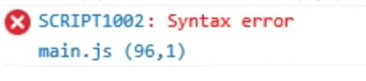
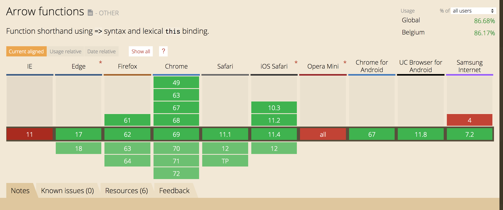

## What is Babel?
Babel is tool used in a lot of javascript projects out there, but as a beginner it can be a little tricky to understand what exactly it does and how to use it. So, what is Babel? This is what the [website](https://babeljs.io/docs/en) says:
> Babel is a toolchain that is mainly used to convert ECMAScript 2015+ code into a backwards compatible version of JavaScript in current and older browsers or environments.

Babel can do a lot things, but at it's core it enables you to write next-generation javascript and makes sure that your browser or [node](https://nodejs.org/en/) can use that javascript.

## Why would I need it?
### Setting up a test-project
To show the magic of Babel, we'll set up a small project where we can play around with some javascript. Create a new folder `babel-test` and inside the folder make a `index.html` with the following markup:

```html
<!doctype html>
<html>
 <head>
  <title>Babel Test</title>
 </head>
 <body>
  <h1>This is a demo for Babel and Webpack</h1>
 </body>
 <script src="/dist/main.js"></script>
</html>
```

Run `npm init` from the command-line in the root of your project, this will create a `package.json`, and the following script to the scripts list:
```javasript
"dev":"webpack --watch",
```

Next we'll need install Webpack. The following command will download Webpack and Webpack-cli and add it to your project's `devDependencies`:
```javascript
npm install webpack webpack-cli --save-dev
```

Since Webpack 4, you don't really need to have your own Webpack configuration, but since we'll go beyond the baseline setup we're going to create one. Create `webpack.config.js` in your root and add the following code:

```javascript
const path = require('path');

module.exports = {
  entry: './src/index.js',
  mode:'development',
  output: {
    filename: 'main.js',
    path: path.resolve(__dirname, 'dist')
  }
};
```

We're saying here in our config file: look for an entry point `./src/index.js` and output it in the `dist` folder. Make a `src` folder and a `dist` folder. In the src-folder we'll create a javascript file called `main.js`. In our HTML we include the link to the built file (`/dist/main.js`).

The project-folder now looks like this:
```bash
├── index.html
├── package.json
├── webpack.config.js
├── src
   ├── main.js
├── dist
```

To test if everything is up and running, we will add some logging to our `main.js`:
```javascript
console.log('Hello world');
```
When you run `npm run dev`, Webpack creates the built files within the dist-folder. If you open the index.html file in your local server environment (Mamp, Laravel Valet, ...) you should see the console.log in your developer tools.

Notice that the `npm run dev` command has the `--watch` flag in our `package.json` so it will keep watching the input file. Every time you save, the `main.js` will be generated in the `dist`-folder. That way we can play around with it, without having to manually save it each time. However, whenever we make changes to the `webpack.config.js`, you will need to restart this watch task.

### Using next-gen javascript
Everything works fine so far, but what happens if we try to use some next-gen javascript in our code? Change the code inside `main.js` to this:

```javascript
const greetings = (name) => {
 return `hello ${name}`;
}
console.log(greetings('Steve'));
```
When you check the console on a modern browser, you will still see the output (`hello Steve`), but what happens when you open the console in IE11?



Why is this? As you can see on [caniuse.com](https://caniuse.com/#search=arrow%20functions), IE11 doesn't have support for arrow functions.



How would you make sure that IE11 users can use your next-gen javascript code? That's right, that's where Babel comes in.

## How to use Babel
The functionality of Babel is split up in different npm-packages, so you can pick the parts you need for your project. For your configuration, Babel will look for a `.babelrc` file in the root.

### Installing the dependencies
We'll go ahead and install all the depencies we are going to need for this project. Make sure that you install `@babel/polyfill` as a dependency, not a dev-dependency:
```js
npm install --save-dev @babel/core @babel/register @babel/preset-env babel-loader
npm install --save  @babel/polyfill
```
These are the packages we'll be using:
#### @babel/core
This package, as the name would suggest, is the core package. The package is responsible for compiling javascript code and outputting usable code. By default it uses your local configuration, but we'll get into that later on.
#### @babel/register
This package will enable us to use new features of javascript in our Webpack config. So not only the code we're going to output runs through Babel, but our javascript config files for Webpack will run through it as well.
#### @babel/preset-env
Knowing what browser supports what javascript feature is essential in transforming your code. Here's where `preset-env` comes in. It handles what transforms should be applied, based on your own input. You tell Babel: "I need support for these browsers" and it will transform your javascript so it will work on the list you provide.
#### @babel/polyfill
Sometimes the browsers you want to support need a little extra help for certain features. `@babel/polyfill` will provide polyfills for those featured, based on what browsers you wish to support.
#### babel-loader
Since we will be using Webpack, this package allows us to transpile our code using Babel and Webpack.

*Do note that the packages all share the same namespace. Babel 7 moved to a monorepo structure, meaning that all packages share the same [repository](https://github.com/babel/babel). The packages used to have their own repository, so if you're installing them, make sure you install the right version.*


### .babelrc
Next up, create a `.babelrc` file in the root of your project. Babel will look for this file as a source for your configuration. There are a lot of options you can set there, but for now, we'll go with these:
```bash
{
	"presets": [
		["@babel/preset-env", {
			"debug":true
		}]
	]
}
```

This will tell Babel to use the `preset-env`-package to look for what browsers to support. The easiest way to tell Babel what browsers to use it to make a `.browserslistrc` file.

### .browserslistrc
Next to the `.babelrc` make a `.browserlistrc`. This file contains a list of the browsers you wish to support. [Browserlist](https://github.com/browserslist/browserslist) has a really nice [tool](http://browserl.ist/) that you can play around with to show you what browsers are selected based on the query you write. For example, this is the one I'm using:
```bash
# Browsers that we support
> .05% in BE
not ie <= 9
```
I want to support every browser that has more then 0.05% coverage in Belgium and that's newer then IE9.

The cool part about the browserslist is that you define your browsers in one place, and other tools like [postCss](https://postcss.org/) will use that same resource. So your supported browsers are defined in a single source of truth, which is a best practice in.

### Webpack
#### Run your javascript through Webpack
Add the following to your `.webpack.config.js`:

```javascript{10,11,12,13,14,15,16,17,18}
const path = require('path');

module.exports = {
	entry: './src/index.js',
	mode: 'development',
	output: {
		filename: 'main.js',
		path: path.resolve(__dirname, 'dist')
	},
	module: {
		rules: [{
			test: /\.js$/,
			exclude: /node_modules/,
			use: {
				loader: 'babel-loader',
			}
		}]
	},
};
```

This will tell Webpack to use the `babel-loader`-plugin when going through your javascript files (except for handling files from within the `node_modules`-folder), so your javascript code goes through Babel's optimisation.

🎉🎉🎉 Refresh the page in IE11 and the console outputs `hello Steve`. The arrow function has been transpiled by Babel so your javascript is now usable by older browsers.

#### Using Babel in your Webpack configuration


#### useBuiltIns: usage
If you take a close look at the output in your console, you'll notice a couple of things:
```javascript
@babel/preset-env: `DEBUG` option

Using targets:
{
  "android": "4.2",
  "chrome": "29",
  "edge": "14",
  "firefox": "48",
  "ie": "11",
  "ios": "7",
  "safari": "9.1"
}

Using modules transform: auto

Using plugins:
  transform-template-literals { "android":"4.2", "chrome":"29", "ie":"11", "ios":"7" }

Using polyfills: No polyfills were added, since the `useBuiltIns` option was not set.
Hash: 4b525102e8dec7ee42f9
Version: webpack 4.18.0
Time: 639ms
Built at: 2018-09-17 12:45:39
  Asset      Size  Chunks             Chunk Names
main.js  3.88 KiB    main  [emitted]  main
Entrypoint main = main.js
[./src/index.js] 111 bytes {main} [built]
```
The first line is pretty simple, it says that we are using the `debug` option, which is true if you look in your `.babelrc`-file:
```javascript
{
 "presets": [
  ["@babel/preset-env", {
   "debug":true
  }]
 ]
}
```

Next up, the list of all the browsers Babel is targeting. Remember, this one is based on the `.browserlistrc`-file.

Then, we get a list of the plugins Babel is using. As you might notice, the list pretty long, while our code in `main.js` is only a couple of lines long 🤔. At the end of the log we get a hint what might be the problem:
```
Using polyfills: No polyfills were added, since the `useBuiltIns` option was not set.
```

The Babel docs learn us that the default option of `useBuiltIns` is false, so let's go ahead and set this option to something else. Modify your `.babelrc` to this:
```
{
	"presets": [
		["@babel/preset-env", {
			"useBuiltIns": "entry",
			"debug":true
		}]
	]
}

```


## Webpack op
### Using ES5 in your webpack config
### babel-loader
- docs a bit unclear
- define your presets in `.babelrc` only


### Polyfill your code
Use polyfill package
Update .babelrc to use `"useBuiltIns": "usage"`


## Bonus: Splitchunks
### Why splitchunking?
### How?
